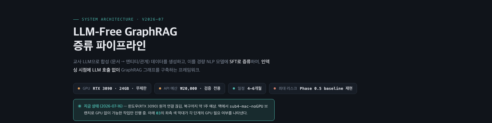
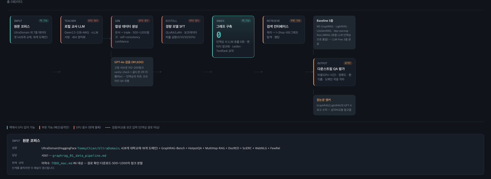

<div align="center">

# LLM-Free GraphRAG

**교사 LLM의 지식을 경량 모델에 증류해, 인덱싱 시점엔 LLM을 한 번도 부르지 않는 GraphRAG**

[](#)
[](TODO.md)
[](#)
[](tests)

[아키텍처 보기](#-아키텍처) · [빠른 시작](#-빠른-시작) · [문서 지도](#-문서-지도) · [현재 상태](#-현재-상태)

</div>

<br>

<p align="center">
  
</p>

교사 LLM(Qwen2.5-32B)으로 합성 (문서 → 엔티티/관계) 데이터를 생성하고, 이를 경량 NLP 모델에 SFT로 증류하여, **인덱싱 시점엔 LLM 호출 없이** GraphRAG 그래프를 구축한다. MS GraphRAG·LightRAG 등 5종 baseline과 동일 조건(로컬 LLM 인덱싱)에서 비용·정확도·환각률을 비교하고, 원 논문 수치를 삼각비교 앵커로 병기한다.

RTX 3090 1장, API 예산 약 ₩20,000으로 진행하는 개인 연구 프로젝트다.

<br>

## 🕸 아키텍처

전체 파이프라인(원문 코퍼스 → 교사 모델 → 합성 데이터 → 증류 → 그래프 구축 → 검색 → QA 평가)을 인터랙티브 다이어그램으로 정리했다. 각 단계는 클릭하면 담당 서브프로젝트·현재 상태가 담긴 패널이 열린다.

<p align="center">
  
</p>

<p align="center">
  <sub>정적 이미지는 미리보기용 — 실제로는 각 단계를 클릭하면 위와 같은 상세 패널이 동적으로 갱신된다. 좌측 색 막대는 GPU 필요 여부(🟢 GPU 없이 가능 · 🟡 부분 가능 · 🔴 GPU 필수)를 나타낸다.</sub>
</p>

```
브라우저에서 직접 열어보기 → graphrag_architecture.html
```

<br>

## ✨ 핵심 아이디어

| | |
|---|---|
| 🎓 **교사 → 학생 증류** | Qwen2.5-32B-Instruct-AWQ가 만든 합성 (엔티티, 관계) 데이터를 경량 모델에 SFT로 증류 |
| 🚫 **인덱싱 LLM 호출 0회** | 그래프 구축(엔티티 정규화 · Leiden · TextRank)은 증류된 경량 모델 + 알고리즘만으로 수행 |
| ⚖️ **공정한 5종 baseline 비교** | MS GraphRAG · LightRAG · LiteSemRAG · dep-parsing(arXiv:2507.03226) · NoLLMRAG — 전부 같은 로컬 LLM 인덱싱으로 통일 |
| 📐 **순환논증 방지** | 교사-학생 일치율과 인간 검수 골드셋 실제 정확도를 분리 산출 |
| 📚 **원 논문 삼각비교** | GraphRAG-Bench 재평가(arXiv:2506.05690) 등 제3자 수치를 앵커로 병기 (`reports/sub3_phase3_6c_anchor.json`) |

<br>

## 🚀 빠른 시작

```bash
git clone <this-repo>
cd Graph_RAg

python3 -m venv .venv
source .venv/bin/activate
pip install -r requirements.txt
python -m spacy download en_core_web_sm

pytest -q          # 57개 테스트 — GPU/외부 서비스 없이도 전부 통과
```

인덱싱/QA 평가를 실제로 실행하려면 `configs/eval.yaml`에 로컬 vLLM 엔드포인트(`teacher_endpoint`)가 떠 있어야 한다. 자세한 내용은 [`spec.md`](spec.md) §2 참고.

<br>

## 📁 구조

```
baselines/          5종 baseline wrapper (GraphRAGMethod 공통 인터페이스 구현)
src/eval/            benchmark 러너 + metrics_*.py (비용·정확도·환각률·일치율)
scripts/             throughput_pilot.py(처리량 사전체크) · prepare_corpus.py(코퍼스 청크 분할)
configs/eval.yaml     실행 설정 (teacher_endpoint, corpus_scope, datasets ...)
reports/              문헌조사·리포트 (원 논문 앵커 수치 등 — 소량 큐레이션 데이터만 버전관리)
tests/                50+ 유닛테스트, 목(mock) 데이터로 GPU 없이도 검증
graphrag_00~05_*.md   서브프로젝트별 연구 설계 문서 (개요·데이터·증류·그래프·평가·도메인적응)
spec.md               서브4(baseline 재현 & 평가)의 실행 가능한 기술 명세
graphrag_architecture.html   인터랙티브 아키텍처 다이어그램 (이 README 상단 이미지의 원본)
```

<br>

## 📊 현재 상태

윈도우(RTX 3090) 원격 연결이 끊겨 있는 동안, `sub4-mac-noGPU` 브랜치에서 GPU 없이 가능한 작업만 진행 중이다.

- ✅ 5종 baseline 중 LLM-free 3종(LiteSemRAG · NoLLMRAG · dep-parsing) 완료 — dep-parsing은 논문(arXiv:2507.03226) 방법론까지 재현
- ✅ metrics 스크립트 + 목데이터 유닛테스트 43개 pass
- ✅ UltraDomain mix 도메인 청크 분할 파이프라인 구축 (2,676개 청크)
- ✅ 원 논문 앵커 수치 수집 및 방법론 재검토
- 🔲 MS GraphRAG·LightRAG 실연동, INDEX(LLM-free 그래프 구축) 프로토타입 — 진행 예정

전체 로드맵은 [`TODO.md`](TODO.md), 맥 전용 작업 목록은 [`TODO_mac.md`](TODO_mac.md)에 있다.

<br>

## 📖 문서 지도

| 문서 | 내용 |
|---|---|
| [`graphrag_00_overview.md`](graphrag_00_overview.md) | 논문 설계, 데이터셋 인벤토리, 전체 일정, 공통 인프라 |
| [`graphrag_01_data_pipeline.md`](graphrag_01_data_pipeline.md) | 서브1 — 합성 데이터 생성 & 검증 |
| [`graphrag_02_distillation.md`](graphrag_02_distillation.md) | 서브2 — 경량 추출 모델 SFT/증류 |
| [`graphrag_03_graph_construction.md`](graphrag_03_graph_construction.md) | 서브3 — 그래프 구축 & 커뮤니티 요약 |
| [`graphrag_04_evaluation.md`](graphrag_04_evaluation.md) / [`spec.md`](spec.md) | 서브4 — baseline 재현 & 다운스트림 평가 |
| [`graphrag_05_domain_adaptation.md`](graphrag_05_domain_adaptation.md) | 서브5 — 도메인 적응 실험 |

<br>

## ⚠️ 리소스 제약

개인 연구자 · 단일 GPU 프로젝트다. 유료 API는 검증 목적(sanity-check, 골드셋 2차 라벨러)에만 소액 사용하며, 인덱싱 자체는 항상 로컬 GPU로만 수행한다 — 자세한 내용은 [`graphrag_00_overview.md`](graphrag_00_overview.md) 상단 참고.

<br>

<div align="center">
<sub>개인 연구 프로젝트 · 논문 준비 중</sub>
</div>
