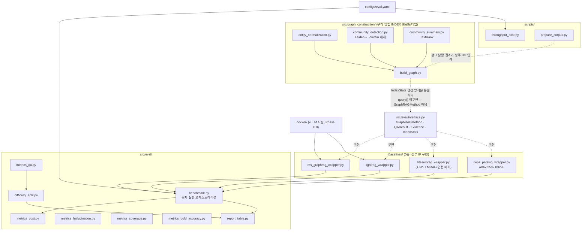

# 코드/문서 리뷰 가이드

이 저장소를 처음부터 훑어볼 때 어떤 순서로, 어떤 걸 눈여겨보며 읽을지 정리한 문서. 연구 설계 자체(파이프라인)는 [`graphrag_00_overview.md`](graphrag_00_overview.md) §1.6과 [`graphrag_architecture.html`](graphrag_architecture.html)에 이미 시각화돼 있으니, 여기서는 **지금 저장소에 실제로 있는 코드가 서로 어떻게 물려 있는지**를 기준으로 삼는다.

## 1. 코드 아키텍처 (모듈 의존관계)

> GitHub 미리보기는 mermaid `click` 인터랙션을 렌더링에서 막아둔 경우가 있다 — 안 눌리면 아래 표/목록의 링크를 대신 쓰면 된다.

**핵심만 짚으면**: [`interface.py`](src/eval/interface.py)가 유일한 계약이고, baseline 5종은 전부 이걸 구현한다. [`benchmark.py`](src/eval/benchmark.py)는 그 계약에만 의존해 구현 세부는 모른 채 순차 실행한다. [`src/graph_construction/`](src/graph_construction) 은 "우리 방법"의 INDEX 단계 프로토타입인데, 아직 `query()`가 없어서 공식적으로는 `GraphRAGMethod`를 구현한 게 아니다(의도적 스코프 컷 — 실제 학생 모델 triple이 있어야 검색까지 의미가 있어서).

## 2. 읽는 순서

1. **현재 상태부터** — [`README.md`](README.md) → [`TODO.md`](TODO.md)(마스터 체크리스트) → [`TODO_mac.md`](TODO_mac.md)(GPU 없이 끝낸 작업 로그, 전부 완료됨). 뭐가 되어 있고 뭐가 블록인지 먼저 파악.
2. **설계 계약** — [`spec.md`](spec.md)(서브4 기술 명세, §4/§8 스키마가 핵심) → [`src/eval/interface.py`](src/eval/interface.py)(그 계약의 실제 코드).
3. **Baseline, 쉬운 것부터** — [`litesemrag_wrapper.py`](baselines/litesemrag_wrapper.py)(LLM-free) → [`deps_parsing_wrapper.py`](baselines/deps_parsing_wrapper.py)(spaCy 의존구문분석, spec.md §9-2와 같이 읽기) → [`ms_graphrag_wrapper.py`](baselines/ms_graphrag_wrapper.py) / [`lightrag_wrapper.py`](baselines/lightrag_wrapper.py)(GPU-backed, spec.md §9-4의 "더미 서버 배선" 배경 먼저 읽기). 각 wrapper는 [`tests/test_baseline_contracts.py`](tests/test_baseline_contracts.py)와 짝지어 읽으면 계약 준수 여부가 바로 보인다.
4. **우리 방법 INDEX** — [`entity_normalization.py`](src/graph_construction/entity_normalization.py) → [`community_detection.py`](src/graph_construction/community_detection.py) → [`community_summary.py`](src/graph_construction/community_summary.py) → [`build_graph.py`](src/graph_construction/build_graph.py), 그리고 [`tests/fixtures/mock_triples.json`](tests/fixtures/mock_triples.json)(입력 예시) + [`tests/test_build_graph.py`](tests/test_build_graph.py)(llm_calls==0 증명이 핵심).
5. **평가 하네스** — [`benchmark.py`](src/eval/benchmark.py) → [`metrics_cost.py`](src/eval/metrics_cost.py) → [`metrics_qa.py`](src/eval/metrics_qa.py) → [`metrics_hallucination.py`](src/eval/metrics_hallucination.py) → ([`metrics_coverage.py`](src/eval/metrics_coverage.py)/[`metrics_gold_accuracy.py`](src/eval/metrics_gold_accuracy.py)는 서브3 리포트를 그대로 읽기만 함, 재계산 없음) → [`difficulty_split.py`](src/eval/difficulty_split.py) → [`report_table.py`](src/eval/report_table.py).
6. **스크립트/설정** — [`scripts/throughput_pilot.py`](scripts/throughput_pilot.py)(처리량 사전체크, 실행부는 아직 🔒) → [`scripts/prepare_corpus.py`](scripts/prepare_corpus.py) → [`configs/eval.yaml`](configs/eval.yaml).
7. **인프라** — [`docker/SETUP_GUIDE.md`](docker/SETUP_GUIDE.md)(vLLM 서빙 셋업, Phase 0.0 진행 중).
8. **연구 배경 (필요할 때만)** — [`graphrag_00_overview.md`](graphrag_00_overview.md) · [`graphrag_01_data_pipeline.md`](graphrag_01_data_pipeline.md) · [`graphrag_02_distillation.md`](graphrag_02_distillation.md) · [`graphrag_03_graph_construction.md`](graphrag_03_graph_construction.md) · [`graphrag_04_evaluation.md`](graphrag_04_evaluation.md) · [`graphrag_05_domain_adaptation.md`](graphrag_05_domain_adaptation.md), [`reports/sub3_phase3_6c_anchor.json`](reports/sub3_phase3_6c_anchor.json).

## 3. 리뷰할 때 특히 눈여겨볼 것

- **[`ms_graphrag_wrapper.py`](baselines/ms_graphrag_wrapper.py)/[`lightrag_wrapper.py`](baselines/lightrag_wrapper.py)는 실제 vLLM이 아니라 로컬 더미 서버([`tests/fixtures/dummy_llm_server.py`](tests/fixtures/dummy_llm_server.py))로만 검증됨** — 배선(연결·형식)은 확인됐지만 추출 품질은 검증 대상이 아니었다. 실제 엔드포인트 대비 재검증 필요(spec.md §9-4).
- **[`entity_normalization.py`](src/graph_construction/entity_normalization.py)는 대소문자/공백만 다른 표기만 병합한다** — "Jobs"를 "Steve Jobs"의 별칭으로 묶는 것 같은 진짜 별칭 해석은 스코프 밖(코드 docstring에 명시).
- **[`deps_parsing_wrapper.py`](baselines/deps_parsing_wrapper.py)는 coreference resolution을 구현하지 않았다** — 논문(arXiv:2507.03226) 기술에는 있지만 별도 라이브러리가 필요해 명시적으로 스킵([`TODO_mac.md`](TODO_mac.md) #1-2 참고).
- **[`reports/sub3_phase3_6c_anchor.json`](reports/sub3_phase3_6c_anchor.json)의 수치는 arXiv HTML 파싱 기반** — 논문에 실제 인용하기 전 PDF 원문 표와 대조 재확인이 `verification_needed` 필드에 명시돼 있음.
- **`corpus_scope`는 아직 `subset`이 기본값** ([`configs/eval.yaml`](configs/eval.yaml)) — [`scripts/throughput_pilot.py`](scripts/throughput_pilot.py)의 실제 실행(Phase 0.5-a0) 결과가 나와야 `full`/`subset`이 확정된다.
- **[`src/graph_construction/`](src/graph_construction)은 검색(`query()`, Phase 3.35)이 없다** — 지금은 그래프를 만드는 것까지만, QA에 쓰려면 검색 인터페이스가 서브3에서 별도로 필요.

## 4. 테스트로 검증된 범위

[`tests/`](tests) 기준 `pytest -q` 실행 시 83 pass + 2 skip(패키지 설치 시 "미설치 실패" 테스트가 정상적으로 skip). GPU/실제 API 없이도 이 커버리지 전부 확인 가능 — 리뷰 중 코드를 고치면 바로 `pytest -q`로 회귀 확인할 것.
